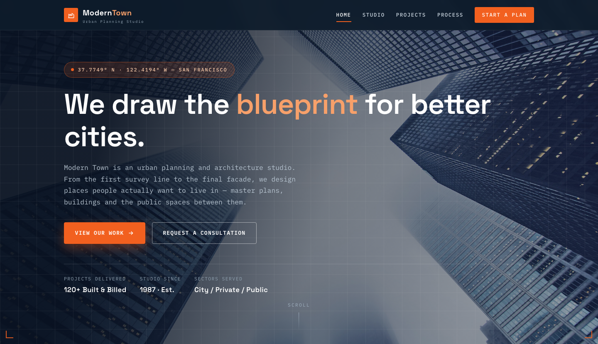

# Modern Town — Urban Planning &amp; Architecture Studio HTML Template

A premium, framework-free HTML template for an urban planning and architecture studio — master planning, architecture, landscape and community development, drawn with blueprint precision. Ink-navy drafting surfaces, signal-orange accents and trace-paper ground, set in Space Grotesk display type with IBM Plex Mono technical labels.

## 📸 Screenshot

## Design System

| Token | Value |
|-------|-------|
| **Brand** | `--navy` `#0d1b2a` (drafting ink), `--navy-deep` `#081120` |
| **Accent** | `--signal` `#f2601f` (signal orange), `--signal-soft` `#f7a06a` |
| **Blueprint** | `--blue` `#1c3a5a`, `--steel` `#5b6b7a` |
| **Ground** | `--paper` `#f6f3ec` (trace paper), `--paper-2` `#ece7db` |
| **Grid lines** | `--grid-line` `rgba(28,58,90,.14)` — 44px blueprint grid |
| **Text** | `--ink` `#14212e`, `--muted` `#5f6b76` |
| **Display type** | `Space Grotesk` (400–700) |
| **Body / label type** | `IBM Plex Mono` (400–600) |
| **Container** | 1180px max-width, centered |
| **Radius** | 3–8px scale, 999px (pill) |
| **Breakpoints** | ~992px, ~576px |

## Pages

| Page | File | Description |
|------|------|-------------|
| Home | [index.html](index.html) | Full-viewport hero over a skyline survey with blueprint grid and registration marks, intro split, six service cards, stats band with count-up counters, project grid, four-step process, testimonial slider, CTA |
| Studio | [about.html](about.html) | Founding story, values, studio manifesto, team cards, 1987–2024 milestones timeline, CTA |
| Projects | [projects.html](projects.html) | Filterable portfolio (master plans / architecture / landscape) with eight project cards |
| Contact | [contact.html](contact.html) | Info list with icons, studio hours, brief form with validation |
| 404 | [404.html](404.html) | On-brand error page with recovery links |

## Features

- **Framework-free** — pure HTML5, CSS3 (custom properties, Grid, Flexbox, `clamp()`), vanilla JavaScript
- **Blueprint drafting identity** — 44px grid-line backgrounds, corner registration marks, sheet/coordinate labels and technical annotation
- **Distinct studio palette** — ink navy + signal orange on trace paper, Space Grotesk + IBM Plex Mono
- **Fluid responsive** — two breakpoints, no horizontal scroll on any viewport
- **Scroll reveal** — IntersectionObserver-powered `.reveal` animations (respects `prefers-reduced-motion`)
- **Mobile nav** — burger toggle with `aria-expanded` accessible pattern
- **Testimonial slider** — auto-advancing slides with dot navigation and pause-on-hover
- **Project filters** — JavaScript-driven category filtering (all / plans / architecture / landscape)
- **Stat counters** — animated number counters triggered on scroll
- **Process steps** — numbered editorial steps with signal-orange numerals
- **Contact form** — project-type select, validation, inline success/error status
- **Sticky header** — darkens and blurs on scroll
- **Original imagery** — city survey, building and landscape photography from the source kit, no placeholders

## Tech Stack

- HTML5 + CSS3 (W3C-valid, semantic landmarks)
- Vanilla JavaScript (canonical IIFE build)
- Google Fonts (Space Grotesk + IBM Plex Mono)
- SVG favicon (inline data: URI)

## SEO

- Semantic HTML5 structure (`<header>`, `<nav>`, `<main>`, `<section>`, `<footer>`)
- Unique `<title>` and `<meta description>` per page
- Open Graph meta on the homepage
- `lang="en"` attribute, `charset="utf-8"`, viewport meta
- Alt text on all images

## Getting Started

Open `index.html` in any modern browser — no build step required. To customize:

1. **Branding** — replace the logo text, contact details and social links in every page header/footer.
2. **Colors** — edit the CSS custom properties at the top of `assets/css/style.css`.
3. **Fonts** — swap the Google Fonts link in each page `<head>`.
4. **Images** — replace files in `assets/img/` keeping the same filenames.
5. **Projects** — add/remove `.project-card` blocks in `projects.html` and `index.html`.

## License

Free for personal and commercial use. Attribution appreciated but not required.

---

## Let's Build Something Together 🚀

[Book a free consultation](https://tally.so/r/q4q1L9)
